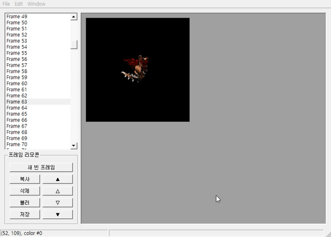
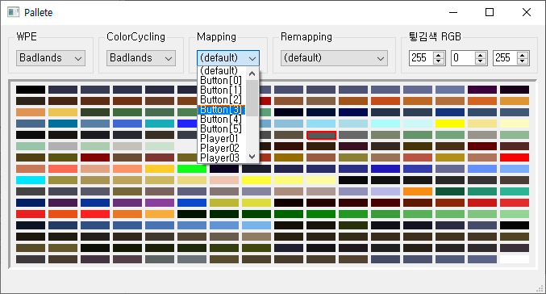

# GrpEditor

Starcraft graphics file (\*.grp) editor built on QT framework.

:warning: Currently, the repository is **NOT** on maintenance. Starcraft has not used \*.grp files since it was remastered. 

## Installing

* Install QT Creator and QT pre-built packages from [QT Homepage](https://www.qt.io/)

* Open a [project file](source/GrpEditor.pro) with QT Creator

## Features

* Choose a color pallete with combinations of 8 tileset WPE, 8 tileset color cycling, and player or button mapping
* Load a \*grp file and draw frames on view
* Create an empty frame
* Move a frame forward/backward
* Copy or delete a frame
* Zoom in/out with scroll
* Save a modified file

## Screenshots

## Issues

* Choosing a remapping causes crash

## Build with

* [QT Creator 4.11.1](https://www.qt.io/)
* [QT 5.14.1 MSVC 2017 64-bit](https://www.qt.io/)

## License

This project is licensed under the LGPL version 3 - see the [LICENSE](LICENSE) file for details
